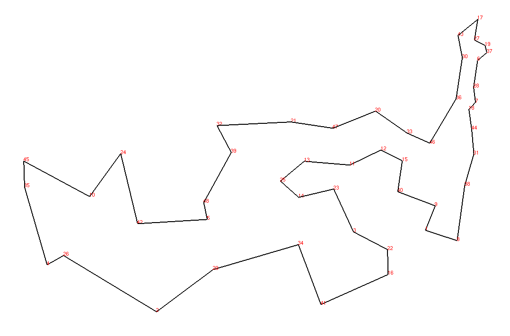

# OptGL - A Graphic Library for Operations Research

## Prerequisites

To be able to use this library, you must install openGL.


## How to Install

To install this library on linux you must download the content of this repository on you PC and after that
put it in a specific folder of your choice.
If the .o and .so files are not present on ./lib and ./objs folders, you need to run the file install.sh. Otherwise, you can follow as showing in the next example.

### Usage example - cartesian.h

The following code example builds a positive plot of a quadratic function, using the Cartesian class.

``` C++

#include <cartesian.h>
#include <iostream>
#include <vector>
#include <cmath>

#define WINDOW_WIDTH 1080
#define WINDOW_HEIGHT 720

void quadraticFunction(std::vector<double> x, std::vector<double> &y){
    for (auto k : x){
        y.push_back(2*pow(k,2) + 3*k + 6);
    }
}


int main(int argc, char ** argv){


    std::cout << "Hello OptGL!\n";

    /*Creating the window*/
    optGLInit(argc, argv, WINDOW_WIDTH, WINDOW_HEIGHT); 

    /*Generating the x and y values*/
    std::vector<double> x, y;

    for(int i = 0; i < 500; i++){
        x.push_back(i);  
    } 

    quadraticFunction(x,y);

    double previousX, previousY;

    previousX = x[0];
    previousY = y[0];
    
    /*Creating the function graph*/
    tPoint origin_point;

    origin_point.x = WINDOW_WIDTH/8;
    origin_point.y = WINDOW_HEIGHT/8;

    Cartesian * my_cartesian = new Cartesian(WINDOW_WIDTH,WINDOW_HEIGHT, origin_point);

    my_cartesian->draw_cartesian(origin_point, x.size(), y.size());

    for(size_t i = 1; i < x.size(); i++){
        my_cartesian->drawLine(previousX, previousY, x[i], y[i]);
        previousX = x[i];
        previousY = y[i];
    } 


    optGLMainLoop();

    return 0;
}

```

To run the code, you must include the shared libraries and the object files directories. You can proceed as showing in the following makefile, beeing /<path_to> the path to optGL library in your computer and /src the source code directory:

``` makefile

src = $(wildcard src/*.cpp)
obj = $(src:.cpp=.o)

OPTGL_PATH=/<path_to>

CXXFLAGS = -std=c++11 -I include/ -I$(OPTGL_PATH) -O3 -lglut -lGLU -lGL -loptcartesian -loptgl -L$(OPTGL_PATH)/lib

optGLExample: $(obj)
	$(CXX) -o $@ $^ $(CXXFLAGS)
clean:
	rm -rf *o optGLExample

```

The following figure shows the result of this example:


### Usage example - graph.h

The following code example builds a graph with 48 vertices, each one with specific coordinates.

``` C++

#include <graph.h>
#include <iostream>

#define WINDOW_WIDTH 1080
#define WINDOW_HEIGHT 720

using namespace std;

int main(int argc, char ** argv){
    std::vector<tPoint>vertices =  {{6734, 1453},
                                    {2233, 10},
                                    {5530, 1424}, 
                                    {401, 841},
                                    {3082, 1644},
                                    {7608, 4458},
                                    {7573, 3716}, 
                                    {7265, 1268},
                                    {6898, 1885},
                                    {1112, 2049},
                                    {5468, 2606},
                                    {5989, 2873},
                                    {4706, 2674},
                                    {4612, 2035},
                                    {6347, 2683},
                                    {6107, 669},
                                    {7611, 5184},
                                    {7462, 3590},
                                    {7732, 4723},
                                    {5900, 3561},
                                    {4483, 3369},
                                    {6101, 1110},
                                    {5199, 2182},
                                    {1633, 2809},
                                    {4307, 2322},
                                    {675, 1006},
                                    {7555, 4819},
                                    {7541, 3981},
                                    {3177, 756},
                                    {7352, 4506},
                                    {7545, 2801},
                                    {3245, 3305},
                                    {6426, 3173},
                                    {4608, 1198},
                                    {23, 2216},
                                    {7248, 3779},
                                    {7762, 4595},
                                    {7392, 2244},
                                    {3484, 2829},
                                    {6271, 2135},
                                    {4985, 140},
                                    {1916, 1569},
                                    {7280, 4899},
                                    {7509, 3239},
                                    {10, 2676},
                                    {6807, 2993},
                                    {5185, 3258},
                                    {3023, 1942}};


    
    optGLInit(argc, argv, WINDOW_WIDTH, WINDOW_HEIGHT);

    Graph * my_graph = new Graph(WINDOW_WIDTH, WINDOW_HEIGHT, vertices);

    std::vector<int>sequence = {1, 9, 40, 15, 12, 11, 13, 25, 14, 23, 3, 22, 16, 41, 34, 29, 2, 26, 4, 35, 
                                45, 10, 24, 42, 5, 48, 39, 32, 21, 47, 20, 33, 46, 36, 30, 43, 17, 27, 19, 
                                37, 6, 28, 7, 18, 44, 31, 38, 8, 1};

    my_graph->draw(sequence); 


    optGLMainLoop();


    return 0;
}

```

You can use the same makefile as before, but with the flag -lgraph instead of -loptcartesian. The following figure ilustrates the output of this code:





<span style="color:red">WARNING</span>: This library is still under construction, therefore some bugs can be easily found.