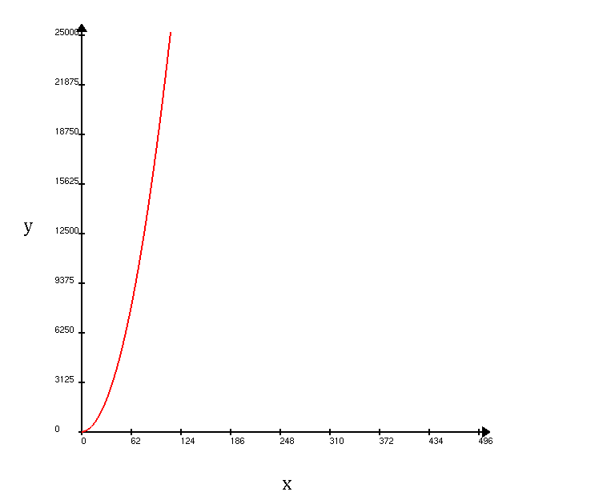

# OptGL - A Graphic Library for Operations Research


## How to Install

To install this library on linux you must download the content of this repository on you PC and after that
put it in a specific folder of your choice.
If the .o and .so files are not present on ./lib and ./objs folders, you need to run the file install.sh. Otherwise, you can follow as showing in the next example.

### Usage example - cartesian.h

The following code example builds a positive plot of a quadratic function, using the Cartesian class.

``` C++

#include <cartesian.h>
#include <iostream>
#include <vector>
#include <cmath>

#define WINDOW_WIDTH 1080
#define WINDOW_HEIGHT 720

void quadraticFunction(std::vector<double> x, std::vector<double> &y){
    for (auto k : x){
        y.push_back(2*pow(k,2) + 3*k + 6);
    }
}


int main(int argc, char ** argv){


    std::cout << "Hello OptGL!\n";

    /*Creating the window*/
    optGLInit(argc, argv, WINDOW_WIDTH, WINDOW_HEIGHT); 

    /*Generating the x and y values*/
    std::vector<double> x, y;

    for(int i = 0; i < 500; i++){
        x.push_back(i);  
    } 

    quadraticFunction(x,y);

    double previousX, previousY;

    previousX = x[0];
    previousY = y[0];
    
    /*Creating the function graph*/
    tPoint origin_point;

    origin_point.x = WINDOW_WIDTH/8;
    origin_point.y = WINDOW_HEIGHT/8;

    Cartesian * my_cartesian = new Cartesian(WINDOW_WIDTH,WINDOW_HEIGHT, origin_point);

    my_cartesian->draw_cartesian(origin_point, x.size(), y.size());

    for(size_t i = 1; i < x.size(); i++){
        my_cartesian->drawLine(previousX, previousY, x[i], y[i]);
        previousX = x[i];
        previousY = y[i];
    } 


    optGLMainLoop();

    return 0;
}

```

To run the code, you must include the shared libraries and the object files directories. You can proceed as showing in the following makefile, beeing /<path_to> the path to optGL library in your computer:

``` makefile

src = $(wildcard src/*.cpp)
obj = $(src:.cpp=.o)

OPTGL_PATH=/home/lucas/Documents/Desenvolvimento/OptGL

CXXFLAGS = -std=c++11 -I include/ -I$(OPTGL_PATH) -O3 -lglut -lGLU -lGL -loptcartesian -loptgl -L$(OPTGL_PATH)/lib

optGLExample: $(obj)
	$(CXX) -o $@ $^ $(CXXFLAGS)
clean:
	rm -rf *o optGLExample

```

The following figure shows the result of this example:




